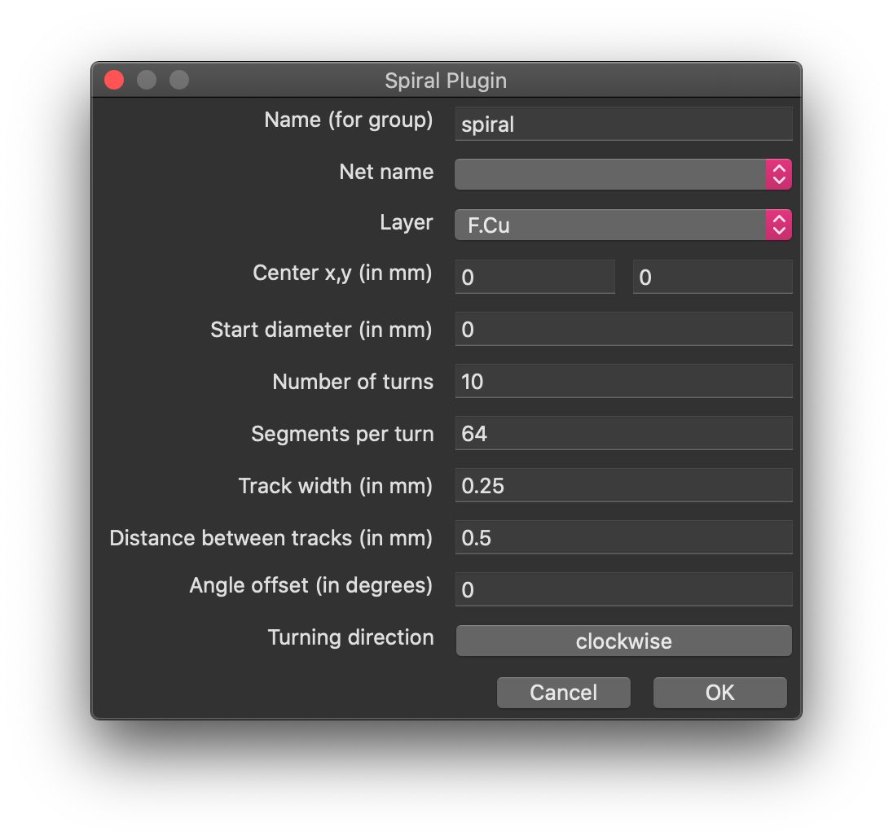
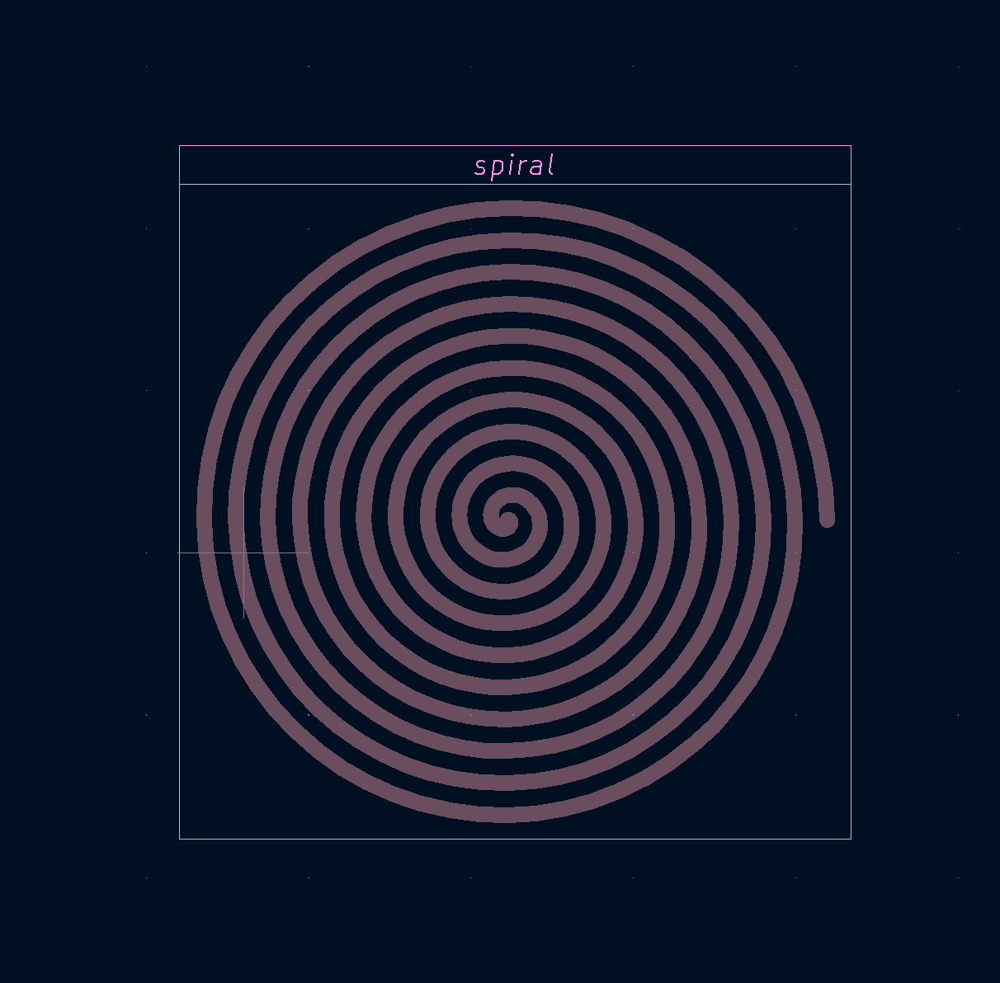

# Kicad Spiral Plugin
A KiCad Plugin for Drawing PCB Tracks in Spiral Shape

(Sorry, but I'm not the most creative fellow when it comes to names...)

## Installation

See here for where to put the top directory:

<https://dev-docs.kicad.org/en/python/pcbnew/>

## User Interface

Besides adding tracks in a spiral shape according to the parameters given in the pop-up menu, which are basically self-explanatory, it adds the tracks to a group, such that the whole spiral can be selected. You can also give the spiral some name, and select its netname and layer. _However, keep in mind that KiCad sees this spiral as a track and not a footprint, therefore be careful on how you are supposed to connect the ends of the coils; the ratsnest won't help you._

## Examples

## Why?

I wanted to create spiral or rather Tesla coils on PCBs. Tesla has written in his patents, such as

<https://patentimages.storage.googleapis.com/0b/3c/ab/eb51aebe935f8c/US512340.pdf>

<https://patentimages.storage.googleapis.com/62/90/92/45a5932052a940/US645576.pdf>

on these and how they have different properties from ordinary coils. Recent researchers, such as Dr. Meyl have had success in replicating Tesla's findings. This plugin makes it possible for anybody to easily create the required spiral coils on PCB and so helps in replicating "old" technology.

Furthermore these coils may be used for inductive charging of e.g. smartphones / tablets.

### Please Note: The current KiCad 6.0 version is broken when it comes to undo/redo support for plugins. KiCad might segfault, although this does not affect the state of your saved board. 
